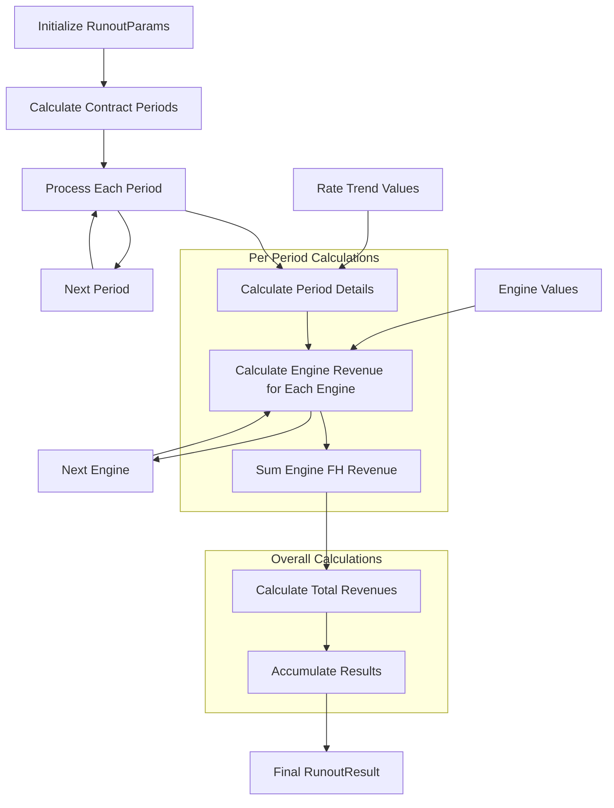
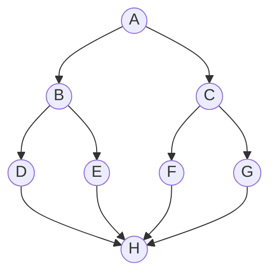
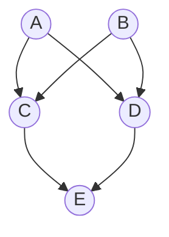

# Financial API

This project is a REST API for financial calculations, specifically focused on GoalSeek and Runout functionalities. It uses the Newton-Raphson method for numerical computations.

## Table of Contents
- [Prerequisites](#prerequisites)
- [Building and Running](#building-and-running)
  - [Using Go](#using-go)
  - [Using Docker](#using-docker)
- [API Endpoints](#api-endpoints)
- [Calculation Engine](#calculation-engine)
- [Sample Requests and Responses](#sample-requests-and-responses)

## Prerequisites

- Go 1.21 or later
- Docker (optional, for containerized deployment)

## Core Structure 


## Building and Running

### Using Go

1. Clone the repository:
   ```
   git clone https://github.com/yourusername/financialapi.git
   cd financialapi
   ```

2. Build the project:
   ```
   go build ./cmd/server
   ```

3. Run the server:
   ```
   ./server
   ```

The API will be available at `http://localhost:8080`.

### Using Docker

1. Build the Docker image:
   ```
   docker build -t financialapi .
   ```

2. Run the container:
   ```
   docker run -p 8080:8080 financialapi
   ```

### Using Docker with Benchmark

You can run tests and benchmarks inside a Docker container without installing Go on your local machine.

1. First, ensure you have built the Docker image as described in the "Building and Running" section.

2. To run all tests:
   ```
   docker run --rm financialapi go test ./...
   ```

3. To run tests with coverage:
   ```
   docker run --rm financialapi sh -c "go test -coverprofile=coverage.out ./... && go tool cover -func=coverage.out"
   ```

4. To run all benchmarks:
   ```
   docker run --rm financialapi go test -bench=. ./...
   ```

5. To run benchmarks with memory allocation statistics:
   ```
   docker run --rm financialapi go test -bench=. -benchmem ./...
   ```

6. To run tests or benchmarks for a specific package (e.g., goalseek):
   ```
   docker run --rm financialapi go test -bench=. ./internal/goalseek
   ```

Note: When running tests or benchmarks in Docker, you won't be able to generate an HTML coverage report or use the Go profiling tools directly. If you need these features, consider running the tests locally with Go installed.

The API will be available at `http://localhost:8080`.
## Testing and Benchmarking

### Running Tests

To run all tests in the project:

```
go test ./...
```

To run tests for a specific package (e.g., goalseek):

```
go test ./internal/goalseek
```

To run tests with coverage:

```
go test -cover ./...
```

For a detailed HTML coverage report:

```
go test -coverprofile=coverage.out ./...
go tool cover -html=coverage.out
```

### Running Benchmarks

To run all benchmarks:

```
go test -bench=. ./...
```

To run benchmarks for a specific package (e.g., goalseek):

```
go test -bench=. ./internal/goalseek
```

To run benchmarks with memory allocation statistics:

```
go test -bench=. -benchmem ./...
```

For more detailed profiling, you can use the `-cpuprofile` and `-memprofile` flags:

```
go test -bench=. -cpuprofile=cpu.out -memprofile=mem.out ./...
```

You can then analyze these profiles using:

```
go tool pprof cpu.out
go tool pprof mem.out
```

## API Endpoints

- POST `/goalseek`: Performs GoalSeek calculation
- POST `/runout`: Performs Runout calculation (under development)

## Calculation Engine

The calculation engine uses the Newton-Raphson method for numerical computations. This method is used to find roots of a function, which in our case, helps in finding the optimal warranty rate for a given target profit.

The Newton-Raphson method works as follows:

1. Start with an initial guess for the root.
2. Calculate the function value and its derivative at this point.
3. Use these values to calculate a better approximation of the root.
4. Repeat steps 2-3 until the approximation is close enough to the actual root.

In our GoalSeek implementation, we use this method to find the warranty rate that achieves a target profit. The function we're finding the root of is the difference between the calculated profit and the target profit.

The Newton-Raphson method is a powerful numerical technique for finding roots of real-valued functions. For a detailed mathematical treatment and analysis of the method.

Ben-Israel, A. (2001). Newton's method with modified functions. Contemporary Mathematics, 204, 39-50.

[Refer to this article on ScienceDirect](https://www.sciencedirect.com/science/article/pii/S0377042700004350)

This paper provides insights into the convergence properties and various modifications of the Newton-Raphson method, which can be particularly useful for understanding the theoretical foundations of our implementation.

## GoalSeek and Newton-Raphson Method

### GoalSeek Functionality

The GoalSeek function in our API aims to find the optimal warranty rate that achieves a target profit. It uses the Newton-Raphson method to iteratively approximate the solution.

### Newton-Raphson Method

The Newton-Raphson method is an efficient algorithm for finding roots of a real-valued function. In our case, we use it to find the warranty rate that results in a specific target profit.

The basic formula for the Newton-Raphson method is:

x_{n+1} = x_n - f(x_n) / f'(x_n)

Where:
- x_n is the current approximation
- f(x_n) is the function value at x_n
- f'(x_n) is the derivative of the function at x_n

### Implementation

Here's a simplified version of our Newton-Raphson implementation:

```go
func GoalSeek(targetProfit float64, params FinancialParams, initialGuess float64) (float64, int, error) {
    objective := func(rate float64) (float64, error) {
        profit, err := CalculateFinancials(rate, params)
        if err != nil {
            return 0, err
        }
        return profit - targetProfit, nil
    }

    derivative := func(rate float64) (float64, error) {
        epsilon := 1e-6
        f1, err1 := objective(rate + epsilon)
        f2, err2 := objective(rate)
        if err1 != nil || err2 != nil {
            return 0, fmt.Errorf("error calculating derivative")
        }
        return (f1 - f2) / epsilon, nil
    }

    return NewtonRaphson(objective, derivative, initialGuess, 1e-8, 100)
}

func NewtonRaphson(f, df func(float64) (float64, error), x0, xtol float64, maxIter int) (float64, int, error) {
    for i := 0; i < maxIter; i++ {
        fx, err := f(x0)
        if err != nil {
            return 0, i, err
        }
        if math.Abs(fx) < xtol {
            return x0, i + 1, nil
        }

        dfx, err := df(x0)
        if err != nil {
            return 0, i, err
        }
        if dfx == 0 {
            return 0, i, fmt.Errorf("derivative is zero, can't proceed with Newton-Raphson")
        }

        x0 = x0 - fx/dfx
    }
    return 0, maxIter, fmt.Errorf("Newton-Raphson method did not converge within %d iterations", maxIter)
}
```

In this implementation:

1. We define an `objective` function that calculates the difference between the computed profit and the target profit.
2. We approximate the derivative using a finite difference method.
3. The `NewtonRaphson` function implements the iterative process, updating the guess until it converges or reaches the maximum number of iterations.

The GoalSeek functionality uses this method to find the warranty rate that achieves the target profit, making it a powerful tool for financial modeling and decision-making.

For a detailed mathematical treatment of the Newton-Raphson method, refer to:

Ben-Israel, A. (2001). Newton's method with modified functions. Contemporary Mathematics, 204, 39-50.
https://www.sciencedirect.com/science/article/pii/S0377042700004350

## Sample Requests and Responses

### GoalSeek Endpoint

Request:
```json
POST /goalseek
Content-Type: application/json

{
  "numYears": 10,
  "auHours": 450,
  "initialTSN": 100,
  "rateEscalation": 5,
  "aic": 10,
  "hsitsn": 1000,
  "overhaulTSN": 3000,
  "hsiCost": 50000,
  "overhaulCost": 100000,
  "targetProfit": 3000000,
  "initialRate": 320
}
```

Response:
```json
{
  "optimalWarrantyRate": 505.93820432563325,
  "iterations": 3,
  "finalCumulativeProfit": 2999999.9999999986
}
```

### Runout Endpoint (Under Development)

Request:
```json
POST /runout
Content-Type: application/json

{
  "contractStartDate": "2022-01-14T00:00:00Z",
  "contractEndDate": "2034-02-14T23:59:59Z",
  "auHours": 480,
  "warrantyRate": 243.6,
  "firstRunRate": 255.13,
  "secondRunRate": 255.13,
  "thirdRunRate": 255.13,
  "managementFees": 15,
  "aicFees": 20,
  "trustLoadFees": 2.98,
  "buyIn": 1352291.05,
  "rateEscalation": 8.75,
  "flightHoursMinimum": 150,
  "numOfDaysInYear": 365,
  "numOfDaysInMonth": 30,
  "enrollmentFees": 25000,
  "numEngines": 2,
  "engineParams": [
    {
      "warrantyExpDate": "2025-10-31T23:59:59Z",
      "warrantyExpHours": 1000,
      "firstRunRateSwitchDate": "2026-11-01T00:00:00Z",
      "secondRunRateSwitchDate": "2027-05-01T00:00:00Z",
      "thirdRunRateSwitchDate": "2028-07-01T00:00:00Z"
    },
    {
      "warrantyExpDate": "2025-10-31T23:59:59Z",
      "warrantyExpHours": 1000,
      "firstRunRateSwitchDate": "2026-11-01T00:00:00Z",
      "secondRunRateSwitchDate": "2027-05-01T00:00:00Z",
      "thirdRunRateSwitchDate": "2028-07-01T00:00:00Z"
    }
  ]
}
```

Response:
```json
{
    "Periods": [
        {
            "StartDate": "2023-01-01T00:00:00Z",
            "EndDate": "2023-12-31T23:59:59Z",
            "NumOfDays": 365,
            "RunoutStartDate": "2023-01-01T23:59:59Z",
            "RunoutEndDate": "2023-12-31T23:59:59Z",
            "NumOfRunoutDays": 365,
            "ContractYearNumber": 1,
            "RateTrend": 1,
            "Engines": [
                {
                    "WarrantyRateDays": 365,
                    "FirstRunRateDays": 0,
                    "SecondRunRateDays": 0,
                    "ThirdRunRateDays": 0,
                    "TotalDays": 365,
                    "FHUtilization": 480,
                    "FHRevenue": 116928,
                    "WarrantyCalc": 88914,
                    "FirstRunRateCalc": 0,
                    "SecondRunRateCalc": 0,
                    "ThirdRunRateCalc": 0,
                    "Rates": 88914,
                    "EscalatedRate": 88914,
                    "Shortfall": 0
                },
                {
                    "WarrantyRateDays": 365,
                    "FirstRunRateDays": 0,
                    "SecondRunRateDays": 0,
                    "ThirdRunRateDays": 0,
                    "TotalDays": 365,
                    "FHUtilization": 480,
                    "FHRevenue": 116928,
                    "WarrantyCalc": 88914,
                    "FirstRunRateCalc": 0,
                    "SecondRunRateCalc": 0,
                    "ThirdRunRateCalc": 0,
                    "Rates": 88914,
                    "EscalatedRate": 88914,
                    "Shortfall": 0
                }
            ],
            "TotalFHRevenue": 1586147
        },
        {
            "StartDate": "2024-01-01T23:59:59Z",
            "EndDate": "2024-12-31T23:59:59Z",
            "NumOfDays": 366,
            "RunoutStartDate": "2024-01-01T23:59:59Z",
            "RunoutEndDate": "2024-12-31T23:59:59Z",
            "NumOfRunoutDays": 366,
            "ContractYearNumber": 2,
            "RateTrend": 1.0875,
            "Engines": [
                {
                    "WarrantyRateDays": 366,
                    "FirstRunRateDays": 0,
                    "SecondRunRateDays": 0,
                    "ThirdRunRateDays": 0,
                    "TotalDays": 366,
                    "FHUtilization": 481.31506849315065,
                    "FHRevenue": 127507.581369863,
                    "WarrantyCalc": 89157.59999999999,
                    "FirstRunRateCalc": 0,
                    "SecondRunRateCalc": 0,
                    "ThirdRunRateCalc": 0,
                    "Rates": 89157.59999999999,
                    "EscalatedRate": 96958.88999999998,
                    "Shortfall": 0
                },
                {
                    "WarrantyRateDays": 366,
                    "FirstRunRateDays": 0,
                    "SecondRunRateDays": 0,
                    "ThirdRunRateDays": 0,
                    "TotalDays": 366,
                    "FHUtilization": 481.31506849315065,
                    "FHRevenue": 127507.581369863,
                    "WarrantyCalc": 89157.59999999999,
                    "FirstRunRateCalc": 0,
                    "SecondRunRateCalc": 0,
                    "ThirdRunRateCalc": 0,
                    "Rates": 89157.59999999999,
                    "EscalatedRate": 96958.88999999998,
                    "Shortfall": 0
                }
            ],
            "TotalFHRevenue": 255015.162739726
        },
        {
            "StartDate": "2025-01-01T23:59:59Z",
            "EndDate": "2025-12-31T23:59:59Z",
            "NumOfDays": 365,
            "RunoutStartDate": "2025-01-01T23:59:59Z",
            "RunoutEndDate": "2025-12-31T23:59:59Z",
            "NumOfRunoutDays": 365,
            "ContractYearNumber": 3,
            "RateTrend": 1.1826562499999997,
            "Engines": [
                {
                    "WarrantyRateDays": 304,
                    "FirstRunRateDays": 61,
                    "SecondRunRateDays": 0,
                    "ThirdRunRateDays": 0,
                    "TotalDays": 365,
                    "FHUtilization": 480,
                    "FHRevenue": 139379.50084315063,
                    "WarrantyCalc": 74054.4,
                    "FirstRunRateCalc": 15562.93,
                    "SecondRunRateCalc": 0,
                    "ThirdRunRateCalc": 0,
                    "Rates": 89617.32999999999,
                    "EscalatedRate": 105986.49543281246,
                    "Shortfall": 0
                },
                {
                    "WarrantyRateDays": 304,
                    "FirstRunRateDays": 61,
                    "SecondRunRateDays": 0,
                    "ThirdRunRateDays": 0,
                    "TotalDays": 365,
                    "FHUtilization": 480,
                    "FHRevenue": 139379.50084315063,
                    "WarrantyCalc": 74054.4,
                    "FirstRunRateCalc": 15562.93,
                    "SecondRunRateCalc": 0,
                    "ThirdRunRateCalc": 0,
                    "Rates": 89617.32999999999,
                    "EscalatedRate": 105986.49543281246,
                    "Shortfall": 0
                }
            ],
            "TotalFHRevenue": 278759.00168630126
        },
        {
            "StartDate": "2026-01-01T23:59:59Z",
            "EndDate": "2026-12-31T23:59:59Z",
            "NumOfDays": 365,
            "RunoutStartDate": "2026-01-01T23:59:59Z",
            "RunoutEndDate": "2026-12-31T23:59:59Z",
            "NumOfRunoutDays": 365,
            "ContractYearNumber": 4,
            "RateTrend": 1.2861386718749996,
            "Engines": [
                {
                    "WarrantyRateDays": 0,
                    "FirstRunRateDays": 304,
                    "SecondRunRateDays": 60,
                    "ThirdRunRateDays": 0,
                    "TotalDays": 364,
                    "FHUtilization": 478.6849315068493,
                    "FHRevenue": 157072.11170023968,
                    "WarrantyCalc": 0,
                    "FirstRunRateCalc": 77559.52,
                    "SecondRunRateCalc": 15307.8,
                    "ThirdRunRateCalc": 0,
                    "Rates": 92867.32,
                    "EscalatedRate": 119440.2516053906,
                    "Shortfall": 0
                },
                {
                    "WarrantyRateDays": 0,
                    "FirstRunRateDays": 304,
                    "SecondRunRateDays": 60,
                    "ThirdRunRateDays": 0,
                    "TotalDays": 364,
                    "FHUtilization": 478.6849315068493,
                    "FHRevenue": 157072.11170023968,
                    "WarrantyCalc": 0,
                    "FirstRunRateCalc": 77559.52,
                    "SecondRunRateCalc": 15307.8,
                    "ThirdRunRateCalc": 0,
                    "Rates": 92867.32,
                    "EscalatedRate": 119440.2516053906,
                    "Shortfall": 0
                }
            ],
            "TotalFHRevenue": 314144.22340047936
        },
        {
            "StartDate": "2027-01-01T23:59:59Z",
            "EndDate": "2027-12-31T23:59:59Z",
            "NumOfDays": 365,
            "RunoutStartDate": "2027-01-01T23:59:59Z",
            "RunoutEndDate": "2027-12-31T23:59:59Z",
            "NumOfRunoutDays": 365,
            "ContractYearNumber": 5,
            "RateTrend": 1.3986758056640618,
            "Engines": [
                {
                    "WarrantyRateDays": 0,
                    "FirstRunRateDays": 0,
                    "SecondRunRateDays": 120,
                    "ThirdRunRateDays": 244,
                    "TotalDays": 364,
                    "FHUtilization": 478.6849315068493,
                    "FHRevenue": 170815.92147401063,
                    "WarrantyCalc": 0,
                    "FirstRunRateCalc": 0,
                    "SecondRunRateCalc": 30615.6,
                    "ThirdRunRateCalc": 62251.72,
                    "Rates": 92867.32,
                    "EscalatedRate": 129891.27362086225,
                    "Shortfall": 0
                },
                {
                    "WarrantyRateDays": 0,
                    "FirstRunRateDays": 0,
                    "SecondRunRateDays": 120,
                    "ThirdRunRateDays": 244,
                    "TotalDays": 364,
                    "FHUtilization": 478.6849315068493,
                    "FHRevenue": 170815.92147401063,
                    "WarrantyCalc": 0,
                    "FirstRunRateCalc": 0,
                    "SecondRunRateCalc": 30615.6,
                    "ThirdRunRateCalc": 62251.72,
                    "Rates": 92867.32,
                    "EscalatedRate": 129891.27362086225,
                    "Shortfall": 0
                }
            ],
            "TotalFHRevenue": 341631.84294802125
        },
        {
            "StartDate": "2028-01-01T23:59:59Z",
            "EndDate": "2028-12-31T23:59:59Z",
            "NumOfDays": 366,
            "RunoutStartDate": "2028-01-01T23:59:59Z",
            "RunoutEndDate": "2028-12-31T23:59:59Z",
            "NumOfRunoutDays": 366,
            "ContractYearNumber": 6,
            "RateTrend": 1.521059938659667,
            "Engines": [
                {
                    "WarrantyRateDays": 0,
                    "FirstRunRateDays": 0,
                    "SecondRunRateDays": 0,
                    "ThirdRunRateDays": 366,
                    "TotalDays": 366,
                    "FHUtilization": 481.31506849315065,
                    "FHRevenue": 186782.9866612447,
                    "WarrantyCalc": 0,
                    "FirstRunRateCalc": 0,
                    "SecondRunRateCalc": 0,
                    "ThirdRunRateCalc": 93377.58,
                    "Rates": 93377.58,
                    "EscalatedRate": 142032.89610698816,
                    "Shortfall": 0
                },
                {
                    "WarrantyRateDays": 0,
                    "FirstRunRateDays": 0,
                    "SecondRunRateDays": 0,
                    "ThirdRunRateDays": 366,
                    "TotalDays": 366,
                    "FHUtilization": 481.31506849315065,
                    "FHRevenue": 186782.9866612447,
                    "WarrantyCalc": 0,
                    "FirstRunRateCalc": 0,
                    "SecondRunRateCalc": 0,
                    "ThirdRunRateCalc": 93377.58,
                    "Rates": 93377.58,
                    "EscalatedRate": 142032.89610698816,
                    "Shortfall": 0
                }
            ],
            "TotalFHRevenue": 373565.9733224894
        },
        {
            "StartDate": "2029-01-01T23:59:59Z",
            "EndDate": "2029-12-31T23:59:59Z",
            "NumOfDays": 365,
            "RunoutStartDate": "2029-01-01T23:59:59Z",
            "RunoutEndDate": "2029-12-31T23:59:59Z",
            "NumOfRunoutDays": 365,
            "ContractYearNumber": 7,
            "RateTrend": 1.6541526832923876,
            "Engines": [
                {
                    "WarrantyRateDays": 0,
                    "FirstRunRateDays": 0,
                    "SecondRunRateDays": 0,
                    "ThirdRunRateDays": 365,
                    "TotalDays": 365,
                    "FHUtilization": 480,
                    "FHRevenue": 202571.5075624257,
                    "WarrantyCalc": 0,
                    "FirstRunRateCalc": 0,
                    "SecondRunRateCalc": 0,
                    "ThirdRunRateCalc": 93122.45,
                    "Rates": 93122.45,
                    "EscalatedRate": 154038.7505422612,
                    "Shortfall": 0
                },
                {
                    "WarrantyRateDays": 0,
                    "FirstRunRateDays": 0,
                    "SecondRunRateDays": 0,
                    "ThirdRunRateDays": 365,
                    "TotalDays": 365,
                    "FHUtilization": 480,
                    "FHRevenue": 202571.5075624257,
                    "WarrantyCalc": 0,
                    "FirstRunRateCalc": 0,
                    "SecondRunRateCalc": 0,
                    "ThirdRunRateCalc": 93122.45,
                    "Rates": 93122.45,
                    "EscalatedRate": 154038.7505422612,
                    "Shortfall": 0
                }
            ],
            "TotalFHRevenue": 405143.0151248514
        },
        {
            "StartDate": "2030-01-01T23:59:59Z",
            "EndDate": "2030-12-31T23:59:59Z",
            "NumOfDays": 365,
            "RunoutStartDate": "2030-01-01T23:59:59Z",
            "RunoutEndDate": "2030-12-31T23:59:59Z",
            "NumOfRunoutDays": 365,
            "ContractYearNumber": 8,
            "RateTrend": 1.7988910430804714,
            "Engines": [
                {
                    "WarrantyRateDays": 0,
                    "FirstRunRateDays": 0,
                    "SecondRunRateDays": 0,
                    "ThirdRunRateDays": 365,
                    "TotalDays": 365,
                    "FHUtilization": 480,
                    "FHRevenue": 220296.5144741379,
                    "WarrantyCalc": 0,
                    "FirstRunRateCalc": 0,
                    "SecondRunRateCalc": 0,
                    "ThirdRunRateCalc": 93122.45,
                    "Rates": 93122.45,
                    "EscalatedRate": 167517.14121470903,
                    "Shortfall": 0
                },
                {
                    "WarrantyRateDays": 0,
                    "FirstRunRateDays": 0,
                    "SecondRunRateDays": 0,
                    "ThirdRunRateDays": 365,
                    "TotalDays": 365,
                    "FHUtilization": 480,
                    "FHRevenue": 220296.5144741379,
                    "WarrantyCalc": 0,
                    "FirstRunRateCalc": 0,
                    "SecondRunRateCalc": 0,
                    "ThirdRunRateCalc": 93122.45,
                    "Rates": 93122.45,
                    "EscalatedRate": 167517.14121470903,
                    "Shortfall": 0
                }
            ],
            "TotalFHRevenue": 440593.0289482758
        },
        {
            "StartDate": "2031-01-01T23:59:59Z",
            "EndDate": "2031-12-31T23:59:59Z",
            "NumOfDays": 365,
            "RunoutStartDate": "2031-01-01T23:59:59Z",
            "RunoutEndDate": "2031-12-31T23:59:59Z",
            "NumOfRunoutDays": 365,
            "ContractYearNumber": 9,
            "RateTrend": 1.9562940093500123,
            "Engines": [
                {
                    "WarrantyRateDays": 0,
                    "FirstRunRateDays": 0,
                    "SecondRunRateDays": 0,
                    "ThirdRunRateDays": 365,
                    "TotalDays": 365,
                    "FHUtilization": 480,
                    "FHRevenue": 239572.4594906249,
                    "WarrantyCalc": 0,
                    "FirstRunRateCalc": 0,
                    "SecondRunRateCalc": 0,
                    "ThirdRunRateCalc": 93122.45,
                    "Rates": 93122.45,
                    "EscalatedRate": 182174.89107099603,
                    "Shortfall": 0
                },
                {
                    "WarrantyRateDays": 0,
                    "FirstRunRateDays": 0,
                    "SecondRunRateDays": 0,
                    "ThirdRunRateDays": 365,
                    "TotalDays": 365,
                    "FHUtilization": 480,
                    "FHRevenue": 239572.4594906249,
                    "WarrantyCalc": 0,
                    "FirstRunRateCalc": 0,
                    "SecondRunRateCalc": 0,
                    "ThirdRunRateCalc": 93122.45,
                    "Rates": 93122.45,
                    "EscalatedRate": 182174.89107099603,
                    "Shortfall": 0
                }
            ],
            "TotalFHRevenue": 479144.9189812498
        },
        {
            "StartDate": "2032-01-01T23:59:59Z",
            "EndDate": "2032-12-31T23:59:59Z",
            "NumOfDays": 366,
            "RunoutStartDate": "2032-01-01T23:59:59Z",
            "RunoutEndDate": "2032-12-31T23:59:59Z",
            "NumOfRunoutDays": 366,
            "ContractYearNumber": 10,
            "RateTrend": 2.1274697351681384,
            "Engines": [
                {
                    "WarrantyRateDays": 0,
                    "FirstRunRateDays": 0,
                    "SecondRunRateDays": 0,
                    "ThirdRunRateDays": 366,
                    "TotalDays": 366,
                    "FHUtilization": 481.31506849315065,
                    "FHRevenue": 261248.84435275613,
                    "WarrantyCalc": 0,
                    "FirstRunRateCalc": 0,
                    "SecondRunRateCalc": 0,
                    "ThirdRunRateCalc": 93377.58,
                    "Rates": 93377.58,
                    "EscalatedRate": 198657.97539324165,
                    "Shortfall": 0
                },
                {
                    "WarrantyRateDays": 0,
                    "FirstRunRateDays": 0,
                    "SecondRunRateDays": 0,
                    "ThirdRunRateDays": 366,
                    "TotalDays": 366,
                    "FHUtilization": 481.31506849315065,
                    "FHRevenue": 261248.84435275613,
                    "WarrantyCalc": 0,
                    "FirstRunRateCalc": 0,
                    "SecondRunRateCalc": 0,
                    "ThirdRunRateCalc": 93377.58,
                    "Rates": 93377.58,
                    "EscalatedRate": 198657.97539324165,
                    "Shortfall": 0
                }
            ],
            "TotalFHRevenue": 522497.68870551226
        },
        {
            "StartDate": "2033-01-01T23:59:59Z",
            "EndDate": "2033-12-31T23:59:59Z",
            "NumOfDays": 365,
            "RunoutStartDate": "2033-01-01T23:59:59Z",
            "RunoutEndDate": "2033-12-31T23:59:59Z",
            "NumOfRunoutDays": 365,
            "ContractYearNumber": 11,
            "RateTrend": 2.31362333699535,
            "Engines": [
                {
                    "WarrantyRateDays": 0,
                    "FirstRunRateDays": 0,
                    "SecondRunRateDays": 0,
                    "ThirdRunRateDays": 365,
                    "TotalDays": 365,
                    "FHUtilization": 480,
                    "FHRevenue": 283331.8665444593,
                    "WarrantyCalc": 0,
                    "FirstRunRateCalc": 0,
                    "SecondRunRateCalc": 0,
                    "ThirdRunRateCalc": 93122.45,
                    "Rates": 93122.45,
                    "EscalatedRate": 215450.27351818263,
                    "Shortfall": 0
                },
                {
                    "WarrantyRateDays": 0,
                    "FirstRunRateDays": 0,
                    "SecondRunRateDays": 0,
                    "ThirdRunRateDays": 365,
                    "TotalDays": 365,
                    "FHUtilization": 480,
                    "FHRevenue": 283331.8665444593,
                    "WarrantyCalc": 0,
                    "FirstRunRateCalc": 0,
                    "SecondRunRateCalc": 0,
                    "ThirdRunRateCalc": 93122.45,
                    "Rates": 93122.45,
                    "EscalatedRate": 215450.27351818263,
                    "Shortfall": 0
                }
            ],
            "TotalFHRevenue": 566663.7330889186
        },
        {
            "StartDate": "2034-01-01T23:59:59Z",
            "EndDate": "2034-12-31T23:59:59Z",
            "NumOfDays": 365,
            "RunoutStartDate": "2034-01-01T23:59:59Z",
            "RunoutEndDate": "2034-12-31T23:59:59Z",
            "NumOfRunoutDays": 365,
            "ContractYearNumber": 12,
            "RateTrend": 2.516065378982443,
            "Engines": [
                {
                    "WarrantyRateDays": 0,
                    "FirstRunRateDays": 0,
                    "SecondRunRateDays": 0,
                    "ThirdRunRateDays": 365,
                    "TotalDays": 365,
                    "FHUtilization": 480,
                    "FHRevenue": 308123.4048670995,
                    "WarrantyCalc": 0,
                    "FirstRunRateCalc": 0,
                    "SecondRunRateCalc": 0,
                    "ThirdRunRateCalc": 93122.45,
                    "Rates": 93122.45,
                    "EscalatedRate": 234302.1724510236,
                    "Shortfall": 0
                },
                {
                    "WarrantyRateDays": 0,
                    "FirstRunRateDays": 0,
                    "SecondRunRateDays": 0,
                    "ThirdRunRateDays": 365,
                    "TotalDays": 365,
                    "FHUtilization": 480,
                    "FHRevenue": 308123.4048670995,
                    "WarrantyCalc": 0,
                    "FirstRunRateCalc": 0,
                    "SecondRunRateCalc": 0,
                    "ThirdRunRateCalc": 93122.45,
                    "Rates": 93122.45,
                    "EscalatedRate": 234302.1724510236,
                    "Shortfall": 0
                }
            ],
            "TotalFHRevenue": 616246.809734199
        }
    ],
    "TotalFHRevenue": 6179552.398680025,
    "MgmtFeeRevenue": 724089.2098020037,
    "AICRevenue": 820634.4377756042,
    "TrustLoadRevenue": 122274.53122856501,
    "TrustRevenue": 4512554.219873852,
    "TotalRevenue": 6179552.398680025,
    "EnrollmentFees": 25000,
    "BuyIn": 1352291
}
```
# Runout Analytical Engine - Future Scope

## Explanation of the Directed Acyclic Graph (DAG)

This Directed Acyclic Graph (DAG) represents the flow of computations in a runout analytical engine, specifically focusing on the calculation of financial outcomes over multiple periods for engines, such as those used in aircraft maintenance scenarios.

## Breakdown of the DAG

### **Initialization and Setup**
- **A: Initialize RunoutParams**: This node represents the initialization of parameters required for the runout calculations. These parameters might include input data such as the number of engines, contract terms, rate trends, etc.

### **Period-Based Calculations**
- **B: Calculate Contract Periods**: This node computes the duration or contract periods over which the runout analysis will be performed. For example, this could involve breaking down the entire contract duration into yearly or monthly periods.
  
- **C: Process Each Period**: This node represents the iteration over each period. The calculations done per period are encapsulated in this node.

  - **D: Calculate Period Details**: Within each period, specific details are calculated, which may include costs, usage, and other period-specific metrics. This calculation is influenced by rate trend values, which are external inputs represented by node **J**.
  
  - **E: Calculate Engine Revenue for Each Engine**: For each engine, the revenue generated during the period is calculated. This calculation depends on engine-specific values, provided by node **K**. The DAG shows that this step is repeated for each engine within a period.
  
  - **E1: Next Engine**: After processing one engine, the system loops back to process the next engine within the same period.

- **C1: Next Period**: After all calculations for the current period are completed (including all engines), the process moves on to the next period.

### **Summation and Accumulation**
- **F: Sum Engine FH Revenue**: After calculating revenue for each engine in a period, these values are summed to get the total revenue for that period.

### **Overall Calculations**
- **G: Calculate Total Revenues**: This node sums the revenue across all periods to calculate the total revenue for the entire contract duration.
  
- **H: Accumulate Results**: This step aggregates all relevant results, possibly including not just revenues but also costs, profits, and other financial metrics across all periods.
  
- **I: Final RunoutResult**: The final node represents the culmination of all calculations into a comprehensive runout result. This result is the output of the entire DAG and might include metrics such as total revenue, cost, profit, and other key financial indicators.

### **External Inputs**
- **J: Rate Trend Values**: External input node that provides rate trends (e.g., inflation, cost of materials, etc.) that affect period calculations.
  
- **K: Engine Values**: External input node that provides specific data for each engine, such as performance metrics or cost parameters.

### **Subgraphs**
- **Per Period Calculations**: The subgraph encapsulates the detailed calculations that occur within each period, including calculating period details, engine revenue, and summing engine FH revenue.
  
- **Overall Calculations**: This subgraph contains the steps that aggregate results across all periods to produce the final runout result.

## Summary
The DAG is structured to handle complex calculations iteratively over multiple periods and engines. It ensures that all necessary calculations are performed for each period and engine, results are summed and accumulated, and a final comprehensive result is generated. This approach is typical in financial modeling, where multiple variables need to be tracked and computed over time.

## DAG in Mermaid



## Sampling Proof



### **Formulating a solution**
```go
package main

import (
	"fmt"
	"sync"
	"time"
)

// Node represents a node in the DAG
type Node struct {
	Name     string
	Function func([]int) int
	Parents  []*Node
	Result   int
}

// DAG represents the Directed Acyclic Graph
type DAG struct {
	Nodes []*Node
}

// AddNode adds a new node to the DAG
func (dag *DAG) AddNode(name string, function func([]int) int, parents ...*Node) *Node {
	node := &Node{
		Name:     name,
		Function: function,
		Parents:  parents,
	}
	dag.Nodes = append(dag.Nodes, node)
	return node
}

// Process executes the DAG
func (dag *DAG) Process() {
	var wg sync.WaitGroup
	for _, node := range dag.Nodes {
		wg.Add(1)
		go dag.processNode(node, &wg)
	}
	wg.Wait()
}

func (dag *DAG) processNode(node *Node, wg *sync.WaitGroup) {
	defer wg.Done()

	// Wait for all parent nodes to complete
	var parentWg sync.WaitGroup
	for _, parent := range node.Parents {
		parentWg.Add(1)
		go func(p *Node) {
			defer parentWg.Done()
			for p.Result == 0 {
				time.Sleep(time.Millisecond)
			}
		}(parent)
	}
	parentWg.Wait()

	// Collect parent results
	parentResults := make([]int, len(node.Parents))
	for i, parent := range node.Parents {
		parentResults[i] = parent.Result
	}

	// Execute node function
	node.Result = node.Function(parentResults)
	fmt.Printf("%s: %d\n", node.Name, node.Result)
}

func main() {
	dag := &DAG{}

	// Define node functions
	rootFunc := func([]int) int { return 1 }
	doubleFunc := func(inputs []int) int { return inputs[0] * 2 }
	averageFunc := func(inputs []int) int {
		sum := 0
		for _, v := range inputs {
			sum += v
		}
		return sum / len(inputs)
	}

	// Create DAG structure
	A := dag.AddNode("A", rootFunc)
	B := dag.AddNode("B", doubleFunc, A)
	C := dag.AddNode("C", doubleFunc, A)
	D := dag.AddNode("D", doubleFunc, B)
	E := dag.AddNode("E", doubleFunc, B)
	F := dag.AddNode("F", doubleFunc, C)
	G := dag.AddNode("G", doubleFunc, C)
	dag.AddNode("H", averageFunc, D, E, F, G)

	// Process the DAG
	startTime := time.Now()
	dag.Process()
	fmt.Printf("Total execution time: %v\n", time.Since(startTime))
}
```

### Why DAG?

- **Flexible DAG structure**: You can easily define complex Directed Acyclic Graph (DAG) structures using the `AddNode` method, allowing for highly customizable workflows.
  
- **Node abstraction**: Each node encapsulates its own processing logic, making the DAG more modular and easier to maintain or update individual components without affecting the overall structure.

- **Automatic dependency resolution**: The `Process` method automatically handles the execution order of nodes based on the defined dependencies, ensuring that tasks are completed in the correct sequence.

- **Parallel execution**: Nodes are processed concurrently whenever possible, leading to more efficient execution, especially in large and complex DAGs.

- **Easy to extend**: You can add new node types or modify existing ones without changing the core DAG logic, making the system highly adaptable to new requirements or changes in the workflow.

### Another attempt to simplify
```go
package main

import (
    "fmt"
    "sync"
    "time"
)

// Node represents a node in the DAG
type Node struct {
    Name     string
    Function func([]int) int
    Parents  []*Node
    Result   int
}

// DAG represents the Directed Acyclic Graph
type DAG struct {
    Nodes []*Node
}

// AddNode adds a new node to the DAG
func (dag *DAG) AddNode(name string, function func([]int) int, parents ...*Node) *Node {
    node := &Node{
        Name:     name,
        Function: function,
        Parents:  parents,
    }
    dag.Nodes = append(dag.Nodes, node)
    return node
}

// Process executes the DAG
func (dag *DAG) Process() {
    var wg sync.WaitGroup
    for _, node := range dag.Nodes {
        wg.Add(1)
        go dag.processNode(node, &wg)
    }
    wg.Wait()
}

func (dag *DAG) processNode(node *Node, wg *sync.WaitGroup) {
    defer wg.Done()

    // Wait for all parent nodes to complete
    var parentWg sync.WaitGroup
    for _, parent := range node.Parents {
        parentWg.Add(1)
        go func(p *Node) {
            defer parentWg.Done()
            for p.Result == 0 {
                time.Sleep(time.Millisecond)
            }
        }(parent)
    }
    parentWg.Wait()

    // Collect parent results
    parentResults := make([]int, len(node.Parents))
    for i, parent := range node.Parents {
        parentResults[i] = parent.Result
    }

    // Execute node function
    node.Result = node.Function(parentResults)
    fmt.Printf("%s: %d\n", node.Name, node.Result)
}

func main() {
    dag := &DAG{}

    // Define our functions
    addFunc := func(inputs []int) int {
        return inputs[0] + inputs[1]
    }
    
    multiplyFunc := func(inputs []int) int {
        return inputs[0] * inputs[1]
    }

    // Create our DAG structure
    A := dag.AddNode("A", func([]int) int { return 5 })  // Constant node
    B := dag.AddNode("B", func([]int) int { return 3 })  // Constant node
    C := dag.AddNode("C", addFunc, A, B)                 // C = A + B
    D := dag.AddNode("D", multiplyFunc, A, B)            // D = A * B
    dag.AddNode("E", addFunc, C, D)                      // E = C + D

    // Process the DAG
    startTime := time.Now()
    dag.Process()
    fmt.Printf("Total execution time: %v\n", time.Since(startTime))
}
```
# DAG Example

This example demonstrates the creation and processing of a Directed Acyclic Graph (DAG) with nodes that perform simple mathematical operations. The DAG is processed with automatic dependency resolution and parallel execution where possible.

## Functions Overview

- **`addFunc`**: A function that takes a slice of integers as input and returns the sum of those integers.
- **`multiplyFunc`**: A function that takes a slice of integers as input and returns the product of those integers.

## Main DAG Example

1. **Create the DAG**: 
   - A new DAG is created with `dag := &DAG{}`.

2. **Add Nodes to the DAG**:
   - **Node A**: Returns a constant value `5`.
   - **Node B**: Returns a constant value `3`.
   - **Node C**: Adds the results of Node A and Node B using `addFunc`.
   - **Node D**: Multiplies the results of Node A and Node B using `multiplyFunc`.
   - **Node E**: Adds the results of Node C and Node D using `addFunc`.

3. **DAG Structure**:
   The DAG structure for this example is visualized as:


4. **Processing the DAG**:
- When `dag.Process()` is called, the DAG is processed in parallel where possible:
  - **Node A** and **Node B** can be processed immediately because they have no dependencies.
  - **Node C** and **Node D** wait for the results from **Node A** and **Node B** to complete, then process in parallel.
  - **Node E** waits for **Node C** and **Node D** to complete, then processes its function.

## `processNode` Function Overview

- **Waits for Parent Nodes**: The function waits for all parent nodes (dependencies) to complete before processing the current node.
- **Collects Parent Results**: It collects the results from all parent nodes as input for the current node's function.
- **Executes Node's Function**: The node's function is executed with the collected parent results as its input.
- **Prints the Result**: After execution, the result of the node's function is printed.

## Advantages of this Approach

- **Flexible DAG Structure**: Easily define complex DAG structures using the `AddNode` method.
- **Node Abstraction**: Each node encapsulates its own processing logic, promoting modularity.
- **Automatic Dependency Resolution**: The `Process` method handles the execution order based on dependencies.
- **Parallel Execution**: Nodes are processed concurrently when possible, optimizing performance.
- **Ease of Extension**: New node types or modifications can be made without changing the core DAG logic.

This example provides a clear illustration of how to build and execute a DAG in a concurrent and dependency-resolved manner, which can be highly beneficial in various computational workflows.

## Contributing

Please read [CONTRIBUTING.md](CONTRIBUTING.md) for details on our code of conduct, and the process for submitting pull requests to us.

## License

This project is licensed under the MIT License - see the [LICENSE.md](LICENSE.md) file for details.
